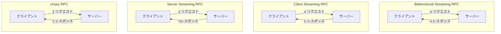
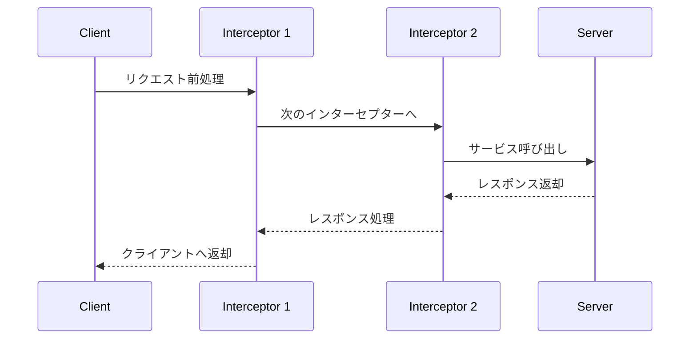

# gRPC を薄皮 1 枚分ぐらい理解する

## 0. はじめに

### AsIs：

- gRPC という言葉は聞いたことある
- g の由来は Google とか good とかなんとか（諸説あり）
- バックエンドのひとが詳しい
- Go やってる人は知ってる率高そう

### ToBe：

- gRPC を初学者にドヤ顔で説明できる
- 簡単なアプリに実装できる

## 1. gRPC とは？

- gRPC（gRPC Remote Procedure Call）とは、異なるシステム間で関数やメソッドを遠隔で呼び出せるように設計された通信プロトコル
- API を「ソフトウェアやサービスが他のソフトウェアやサービスとどのように相互作用するかを定義するインターフェース」という広い意味で捉えると、gRPC や SOAP, RESTful API などが API というもの中に包含されるようなイメージ。

## 2. gRPC の 4 つの通信方式

クライアントとサーバーでリクエストとレスポンスの数が、
1 対 1, 1 対 n, n 対 1, n 対 n のそれぞれに対応している。

- Unary RPC（ユニキャスト RPC）

- Server Streaming RPC（サーバーストリーミング RPC）

- Client Streaming RPC（クライアントストリーミング RPC）

- Bidirectional Streaming RPC（双方向ストリーミング RPC）



## 3. Protocol Buffers

- gRPC に欠かせない存在。<br>
- Google によって開発されたシリアライゼーションフォーマット
- `.proto`拡張子のファイルを作成し、そこで gRPC で通信するデータ構造やサービス（処理みたいなもん）を定義
- `.proto`ファイルを各言語のデータ型にコンパイルすることで、サーバーやクライアントの処理ファイルを簡単に生成できる

### <u>`.proto`ファイルの構成要素</u>

主に下記で構成される。

- `syntax`：Protocol Buffers ファイルのバージョン指定（最新は proto3）

  ```proto
  syntax = "proto3";
  ```

- `package`：`message`や`service`を定義する名前空間

  ```proto
  // この.protoファイルで定義したmessageとserviceは'user'という名前空間に属する
  package user;
  ```

- `option`：生成されるファイル（コード）に関する設定を指定できる

  ```proto
  // go_packageオプションで生成するコードのインポートパスを指定
  option go_package = "path/to/dir/";
  ```

- `message`：Protocol Buffers でやり取りされるデータの構造を定義

  ```proto
      message User {
      int32 id = 1;  // ユーザーID
      string name = 2;  // ユーザー名
      repeated string phone_numbers = 3;  // 複数の電話番号を持つフィールド
      Address address = 4;  // Addressメッセージ型のユーザーの住所
  }
  ```

  ※ 各行末尾の 1,2,3,4 などの数字は値を代入しているわけではない。同一`message`内のフィールドを識別するための index みたいなもの。

- `service`：gRPC で提供されるリモートメソッドの定義。ここで定義した処理を異なるサービス間で呼び出して使えるようになる。
  ```proto
  // GetUserメソッドを定義
  service UserService {
    rpc GetUser (GetUserRequest) returns (GetUserResponse);
  }
  ```

## 4. Interceptor

- 複数の RPC メソッドに適用される汎用的な処理をリクエストとレスポンスの前後に追加できる機能
- Interceptor を使用することで、メタデータの検証やロギング、認証・認可などの機能を実装できる
- RPC の種類によって、Unary Interceptor と Stream Interceptor の 2 種類がある


